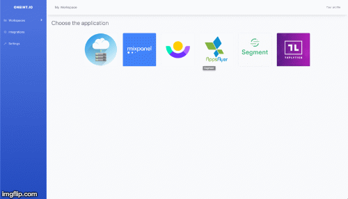
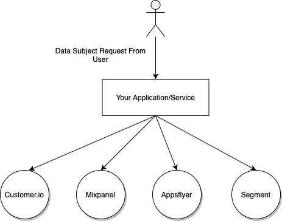
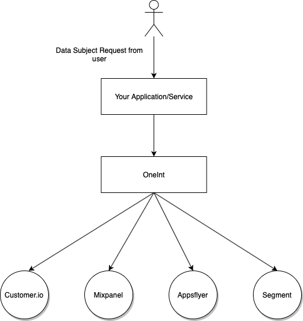

# OneInt - Create and manage GDPR/CCPA data-subject requests with ease. (beta)



## Summary
OneInt - Data Privacy Platform that helps create and manage data subject requests(access/delete) from your users.

**If you have ANY questions regarding the platform, let us know**

[Why OneInt?](#why-oneint)

[Installation](#installation)

[Contributions](#contributions)

[How it works?](#how-it-works)

[API](#api)

[Roadmap](#roadmap)

[Support](#support)

## Why OneInt?
If you need to comply with GDPR/CCPA, you will likely need to address consumers requests to access or delete data. Our goal is to make this process less painful and more transparent. If you're building any application/service, you probably use at least several third-party services like(Mixpanel, customer.io, Appsflyer, etc), that means that you need to send requests to these services to access/delete data.

OneInt does that job for you.

| Without OneInt  | With OneInt |
| --------------- | ----------- |
|   |   |

## Installation

**More detailed documentation is coming.**

### Tech Stack
 - Ruby
 - Rails
 - MySql
 - Sidekiq for background jobs
 - Redis

### Installation instructions
It's v0 and we're planning to add Packages/Docker/etc in the future versions but for now you can install it from source.
OneInt is a Rails application, if you're not familiar how to run the rails app - let us know and we'll be more than happy to help with the installation.

### Configuration/ENV variables
In the root of the repo you can find .env.example file. Copy it and save as .env file in the root of the app.
You will need manually set the following variables before launching the app.

| ENV variable               | Meaning/Value                  |
| -------------------------- | ------------------------------ |
| SECRET_KEY_FOR_ENCRYPTION  | 32-byte Secret key that will be used to encrypt API keys keys before saving to DB |
| SIDEKIQ_USERNAME           | Sidekiq username to access sidekiq admin panel                                    |
| SIDEKIQ_PASSWORD           | Sidekiq password to access sidekiq admin panle                                    |
| BASE_URL                   | URL where you host the application.                                               |
| STORAGE_TYPE               | 'memory' OR 'file_system' OR 's3'(default). For file storage                      |
| STORAGE_AWS_REGION         | 'us-east-1' is a default one                                                      |
| STORAGE_S3_BUCKET          | Name of the bucket where you want to store files                                  |
| AWS_ACCESS_KEY_ID          | Your AWS access key                                                               |
| AWS_SECRET_ACCESS_KEY      | Your AWS secret access key                                                        |

### Integration with your own service(custom webhook)
If you've added a custom webhook integration, OneInt will send a JWT that you can decode with your public key using ES384 algorithm.

## How it works?
1. Add the integration with third-party(or your own) services. Usually it's done by adding your API key/token but requirements vary from platform to platform.
2. Create a request either via API or UI. OneInt provides a simple API that you can use when for example user clicks 'delete account' button in your application.
3. Once OneInt receives a request it will automatically send the request to all integrations you have.
4. Monitor the status of the request on the dashboard.
5. Retrieve the files once they're ready. (in case if it's an 'export' request)

## API

### Authentication
Add ```HTTP_API_KEY``` header name. Header value is your API key which can be found on the Settings page

### Create a request
```POST /requests```

| Params              | Required? | Value                                           |
| --------------------|-----------|-------------------------------------------------|
| request_type        | Yes       |  'export' or 'delete'                           |
| user_id             |.Yes       |  User ID that you send to third-party providers |
| appsflyer_attributes| N*        | Please see below                                |

**Appsflyer integration specifics**
Appsflyer requires to send the advertising id of the user. That's why you should include the appsflyer attributes if you're using this service. 
```
appsflyer_attributes: {
  advertising_id: <USER Specific advertising id>
}
```

### Fetch requests
```GET /requests```

returns last 150 records.

## Roadmap
We have a list of features we want to build but also we need your feedback and requests.
Some of the features we're going to build in the next versions:
 - Yes, we're planning to add integrations with other popular services.
 - Verification of the requests
 - Privacy center

## Contributions
Feel free to submit a PR if you want to Contribute to the project

## Support
If you need a Support or any additional features - let us know
